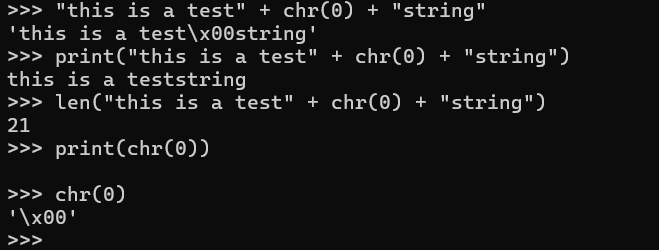
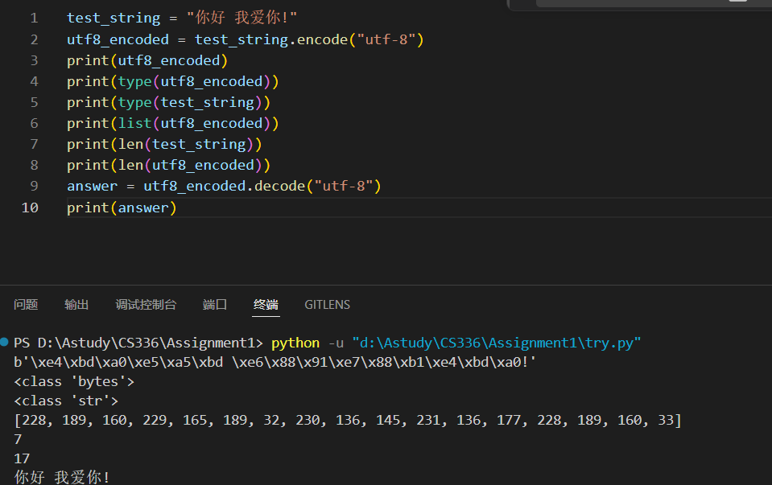
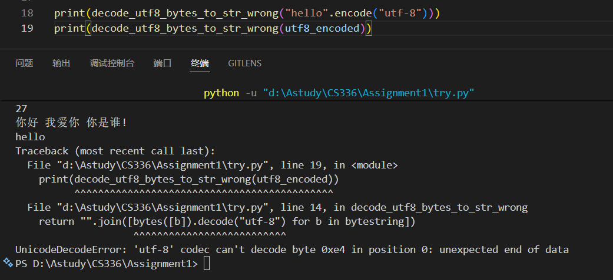
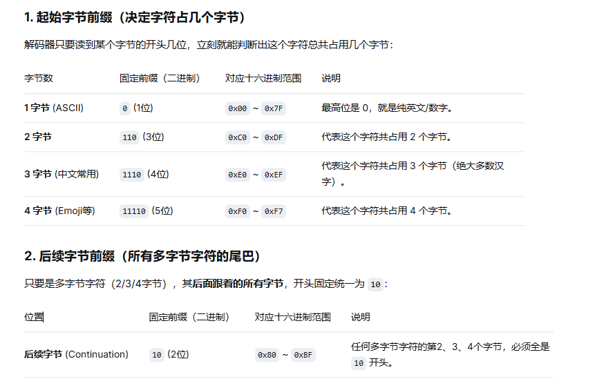

### 回答PDF中的问题

- Problem (Unicode1)
- (a): '\x00'
- (b): the function __repr__() returns the python's string and print calls the function '__str__()' which returns the string we like
- (c):    the '\x00' would print nothing but have one lenth.

- Problem (Unicode2)
- (a):  因为 UTF-8 是“字节流”，而 UTF-16/32 是“双字节/四字节整数流”。
大模型要处理的是“二进制序列”，而非“人类语义字符”。UTF-8 用 256 个基础槽位(不会有过多的浪费 导致浪费context)、无字节序烦恼、天然紧凑，完美适配 BPE（字节对编码）算法 另外两者还有大小端读取问题 涉及到硬件层面。
- (b):  utf-8 会把汉字编码成多个字节 该函数是单个字节处理的 会出错不能成功解码
- (c): b = b'\x80\x81' utf-8 要求如果是多字节字符,需要严格按照固定前缀

